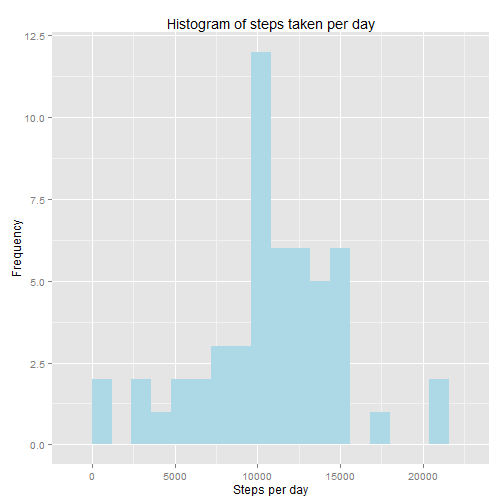
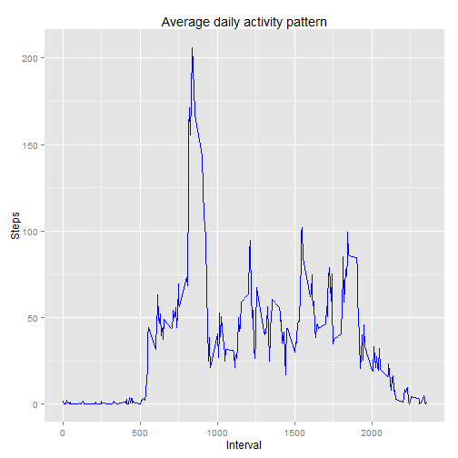
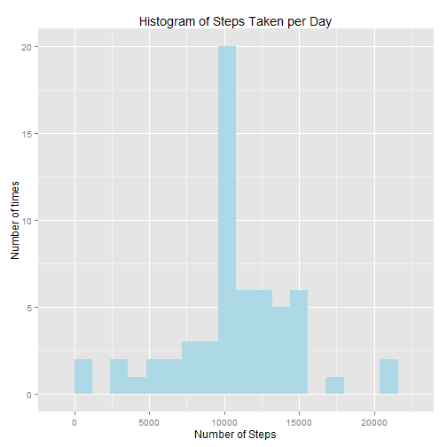
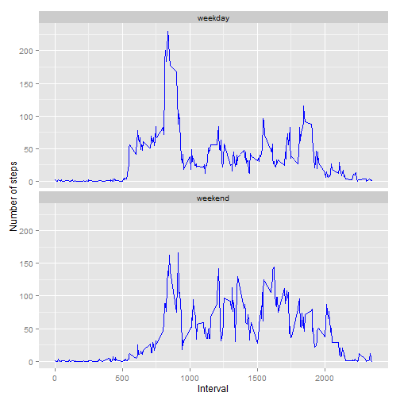

This is an R Markdown document prepared for the Peer Assessment 1 of Reproducible Research course.

###Loading and preprocessing the data 

Read the data and check the content


```r
actData <- read.csv('activity.csv', colClass=c('integer', 'Date', 'integer'))
str(data)
```

```
## function (..., list = character(), package = NULL, lib.loc = NULL, 
##     verbose = getOption("verbose"), envir = .GlobalEnv)
```

###What is the mean total number of steps taken per day ?

1.Calculate the total steps per day and display the first few rows to check


```r
totSteps <- aggregate(steps ~ date, actData, sum)
head(totSteps)
```

```
##         date steps
## 1 2012-10-02   126
## 2 2012-10-03 11352
## 3 2012-10-04 12116
## 4 2012-10-05 13294
## 5 2012-10-06 15420
## 6 2012-10-07 11015
```

2.Histogram of the total number of steps taken each day 

```r
library(ggplot2)
ggplot(totSteps, aes(x = steps))+ geom_histogram(fill = "lightblue", binwidth = 1200) + labs(x="Steps per day",y="Frequency", title="Histogram of steps taken per day")
```

 

3. Mean and median of total number of steps taken per day

```r
mean(totSteps$steps, na.rm = TRUE) 
```

```
## [1] 10766.19
```

```r
median(totSteps$steps, na.rm = TRUE)
```

```
## [1] 10765
```

###What is the average daily activity pattern 
1. Make a time series plot of 5 minute interval and average number of steps taken across all days


```r
avgSteps <- aggregate(steps ~ interval, actData, mean)
ggplot(avgSteps, aes(x=interval, y=steps)) + geom_line(color = "blue") + 
  labs(x="Interval",y="Steps", title="Average daily activity pattern")
```

 

2. Find out the 5 minute interval contains the maximum number of steps 

```r
avgSteps$interval[which.max(avgSteps$steps)]
```

```
## [1] 835
```

###Imputing missing values 
1. Total number of missing values i.e. the total number of rows with NAs)

```r
sum(is.na(actData$steps))
```

```
## [1] 2304
```


2. Strategy for filling in all of the missing values in the dataset. 

```r
newactData <- actData
naData <- is.na(newactData$steps)
avgInt <- tapply(newactData$steps,newactData$interval,mean, na.rm=TRUE, simplify=TRUE)
newactData$steps[naData] <- avgInt[as.character(newactData$interval[naData])]
sum(is.na(newactData$steps))
```

```
## [1] 0
```

3.  Make a histogram of the total number of steps taken each day 

```r
stepseachday <- aggregate(steps ~ date, newactData, sum)

ggplot(stepseachday, aes(x = steps)) + 
       geom_histogram(fill = "lightblue", binwidth = 1200) + 
        labs(title="Histogram of Steps Taken per Day", 
             x = "Number of Steps", y = "Number of times")
```

 

4.Calculate and report the mean and median total number of steps taken per day

```r
mean(stepseachday$steps, na.rm = TRUE) 
```

```
## [1] 10766.19
```

```r
median(stepseachday$steps, na.rm = TRUE)
```

```
## [1] 10766.19
```


###Are there differences in activity patterns between weekdays and weekends?

1. Create a new factor variable in the dataset with two levels - "weekday" and "weekend" indicating whether a given date is a weekday or weekend day.


```r
typeofday <- function(dates) {
  res <- function(date) {
    if (weekdays(date) %in% c("Saturday", "Sunday")) {
      "weekend"
    }
    else {
      "weekday"
    }
  }
  sapply(dates, res)
}

newactData$typeofday <- as.factor(typeofday(newactData$date))

str(newactData) 
```

```
## 'data.frame':	17568 obs. of  4 variables:
##  $ steps    : num  1.717 0.3396 0.1321 0.1509 0.0755 ...
##  $ date     : Date, format: "2012-10-01" "2012-10-01" ...
##  $ interval : int  0 5 10 15 20 25 30 35 40 45 ...
##  $ typeofday: Factor w/ 2 levels "weekday","weekend": 1 1 1 1 1 1 1 1 1 1 ...
```

2. Make a panel plot containing a time series plot (i.e. type = "l") of the 5-minute interval (x-axis) and the average number of steps taken, averaged across all weekday days or weekend days (y-axis)

```r
avgstep <- aggregate(steps ~ interval + typeofday, newactData, mean) 
ggplot(avgstep, aes(x=interval, y=steps)) +
  geom_line(color = "blue") + facet_wrap(~typeofday, ncol = 1, nrow=2) + 
  labs(x="Interval", y="Number of steps")
```

 
